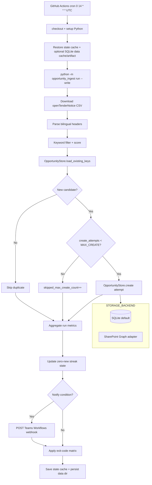
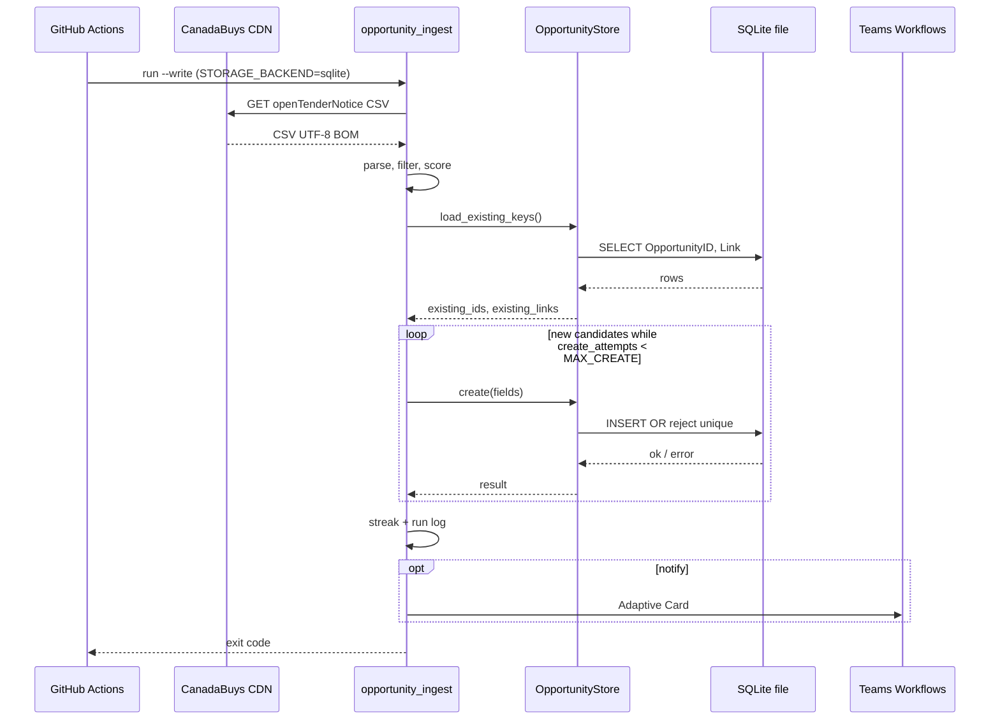
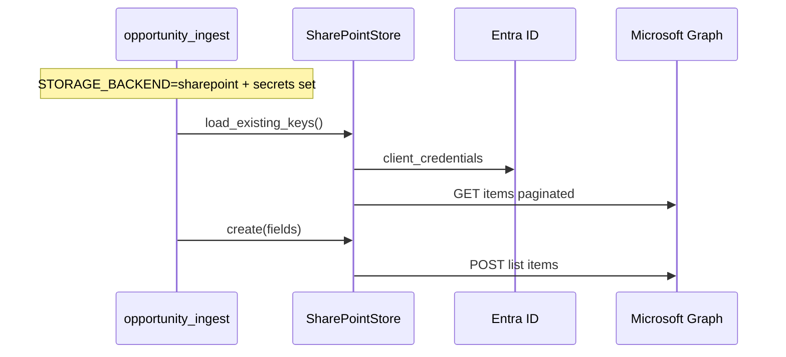

# Phase 1 Design: CanadaBuys Opportunity Ingestion (Local-First + SharePoint-Ready)

| Field | Value |
|-------|--------|
| **Document title** | Complete Implementation Schema — CanadaBuys Open Tender → Contract Opportunities Storage |
| **Author** | _TBD_ |
| **Date** | 10 August 2026 |
| **Status** | Draft (rev 4 — user product decisions: local-first storage) |
| **Spec version** | Phase 1 Technical Specification v1.0 (adapted: storage backend pluggable) |
| **Audience** | Engineers implementing Phase 1 in a greenfield repo |

---

## Overview

Phase 1 builds a low-maintenance daily pipeline that downloads the official CanadaBuys **Open Tender Notices** CSV, filters for potentially relevant opportunities using configurable keywords, deduplicates against existing records, and **creates only new records** into a durable store that matches the **Contract Opportunities** logical schema.

**Day-1 primary storage is local (SQLite), not SharePoint.** A **storage backend abstraction** makes SharePoint a config switch later (`STORAGE_BACKEND=sqlite|sharepoint`). Both backends implement the same create/dedupe interface and the same logical fields. The SharePoint Graph adapter is **implemented in Phase 1** but **not required** for production schedule go-live (no Entra app / site grant blocks local launch).

The pipeline runs on scheduled GitHub Actions, persists opportunities (and optionally the SQLite file) via Actions artifacts/cache as appropriate, and surfaces failures (and multi-day “zero new records” dryness) via a **Microsoft Teams Workflows webhook**.

This document is **implementation-ready**: repo layout, CSV mapping (live headers 10 August 2026), SQLite DDL, storage Protocol, Graph adapter shapes, keywords/scoring, dry-run, streak state, Actions YAML, deferred SharePoint provisioning runbook, tests, rollout with **MAX_CREATE** attempt budget, frozen CLI/exit codes, and ordered PR plan.

---

## Background & Motivation

### Current state

The workspace `contractbiddingsystem` is **greenfield**. There is no existing ingestion code or CI schedule. Opportunity discovery today, if any, is manual browsing of CanadaBuys / MERX.

### Pain points

- Relevant federal tenders are easy to miss without a daily sweep.
- CanadaBuys open data is free and authoritative but bilingual, wide (67 columns), and noisy.
- Manual copy-paste creates duplicates and incomplete links/dates.
- SharePoint / Entra permissions may not be ready on day 1; the team still needs a working list to review.

### Why local-first Phase 1

User decision (final): **SharePoint is not day-1 primary storage.** Build a local system first such that pointing configuration at SharePoint later “just works.” SQLite provides durable unique indexes on OpportunityID/Link, zero cloud dependency for write path, offline CI, and simple human review via SQL or CSV export. SharePoint remains the long-term collaboration surface and is implemented as a **pluggable adapter** now.

### Authoritative source

| Item | Value |
|------|--------|
| Primary CSV | `https://canadabuys.canada.ca/opendata/pub/openTenderNotice-ouvertAvisAppelOffres.csv` |
| Optional later | `https://canadabuys.canada.ca/opendata/pub/newTenderNotice-nouvelAvisAppelOffres.csv` |
| Auth | None (public open data) |
| Refresh | Daily ~07:00–08:30 America/Toronto (UTC-0500 per PSPC docs; observe DST operationally) |
| Dataset docs | [Open Government Portal — Tender notices](https://open.canada.ca/data/en/dataset/6abd20d4-7a1c-4b38-baa2-9525d0bb2fd2), [Supporting documentation](https://donnees-data.tpsgc-pwgsc.gc.ca/ba2/ac-cb/soutien-support-eng.html) |

**Live verification (10 August 2026):** Open CSV downloaded successfully — **67 columns**, UTF-8 BOM, bilingual single-row headers. Re-download via `download-sample` at implementation start.

---

## Goals & Non-Goals

### Goals

1. Automatically download, parse, filter, dedupe, and write CanadaBuys open tenders into a **Contract Opportunities** store using the Phase 1 **logical schema** (Link = full plain-text URL, never silent-truncated).
2. **Default backend: SQLite** (`contract_opportunities` table) with unique indexes for dedupe; optional CSV export for human review.
3. **Implement SharePoint Graph backend** as a pluggable adapter; activate later via `STORAGE_BACKEND=sharepoint` without rewriting pipeline logic.
4. Run unattended once per day via GitHub Actions after the CanadaBuys morning refresh.
5. Avoid almost all duplicates (by `OpportunityID` and `Link`).
6. Log counts every run; notify on hard failure, high partial-error counts, or N consecutive days with zero new items (Teams Workflows webhook — useful even with local storage).
7. Support local dry-run; production write with `--write` against the configured backend.
8. Bound first-week write volume with soft cap `MAX_CREATE` (create-**attempt** budget, default 50).
9. Leave clean extension points for multi-source and better scoring without building them now.

### Non-Goals (Phase 1)

- MERX, Ontario, municipal, or other sources
- AI / LLM ranking or proposal generation
- Historical backfill of expired tenders
- Complex Power Apps UI
- Bid submission automation
- Day-1 requirement for Entra app / SharePoint site access
- Amendment in-place updates (create-only on all backends)
- Multi-source adapter implementations (interface sketch only)
- Google Sheets as primary store (optional future alternative only; SQLite is the recommendation)

**PR review discipline:** Reject keyword/AI creep and multi-source adapters in Phase 1 PRs. Keyword file changes: **engineering-owned** (ops requests via issues).

### Success criteria (Phase 1, local-first)

1. Job runs daily without manual intervention  
2. New relevant opportunities appear in the **local store** (query SQLite or open CSV export)  
3. Duplicates almost never created  
4. Store is immediately reviewable (Status starts at `New`)  
5. Failure notifications work (Teams Workflows)  
6. Switching to SharePoint later is **config + secrets + one-time SP provisioning** only — same CLI and pipeline  

---

## Key Decisions

| ID | Decision | Rationale |
|----|----------|-----------|
| KD-1 | **Language: Python 3.11+** | CSV/`httpx`/`msal`/stdlib `sqlite3` ergonomics; easy unit tests. |
| KD-2 | **Scheduler: GitHub Actions** | Spec recommendation; secrets native; failure notifications. |
| KD-3 | **SharePoint: Graph + Entra client credentials when activated** | App-only for unattended jobs; prefer `Sites.Selected` + one-time site grant. **Not required for day-1 go-live** (local SQLite). |
| KD-4 | **HTTP client: `httpx` + `msal` (not full Graph SDK)** | Light deps; mockable; only needed for SharePoint backend + CSV download uses httpx. |
| KD-5 | **OpportunityID = `referenceNumber`**, fallback `solicitationNumber` | CanadaBuys-native keys per PSPC guidance. |
| KD-6 | **Dedupe: load existing OpportunityID + Link sets via storage backend, in-memory check** | Works for both SQLite and SharePoint; unique indexes in SQLite enforce integrity. |
| KD-7 | **Primary notification: Teams Workflows webhook** | Supported channel path; useful with local storage for ops alerts. |
| KD-8 | **Zero-new streak: `state/zero_new_streak.json` via Actions cache** | Unique key `…-${{ github.run_id }}-${{ github.run_attempt }}` + restore-keys; `continue-on-error` on save. |
| KD-9 | **Keyword config: `config/keywords.yaml`; engineering owns PRs** | Ops requests changes via issues; eng reviews/merges. |
| KD-10 | **Dry-run default locally; `--write` enables persistence** | For sqlite, `--write` needs `DATA_DIR`/DB path only (no cloud secrets). For sharepoint, `--write` needs Azure/SharePoint secrets. |
| KD-11 | **Single daily concurrency group** | Queue overlapping runs; no distributed lock. |
| KD-12 | **English CSV fields preferred; French fallback** | Maximize non-empty Title/Description/Link. |
| KD-13 | **RelevanceScore rule-based 0–100; scoring clock UTC** | Explainable; no ML. |
| KD-14 | **Description truncated to 2000 chars** | Readability; full text on notice URL. |
| KD-15 | **Link = full plain-text URL; never silent-truncate** | Multi-line text in logical/SP schema; TEXT in SQLite. Oversize under a hard limit → skip row. |
| KD-16 | **Partial-failure exit policy** | Hard fail or `error_count >= 5` → exit 1 + notify; soft partial → exit 0. |
| KD-17 | **`MAX_CREATE` = create-attempt budget (default 50)** | Caps attempts (success or fail), not only `added_count`. **Resolved post-calibration policy:** see Resolved Decisions. |
| KD-18 | **Notify ownership: Python + Actions backup if `notified != true`** | No double-notify for handled failures. |
| KD-19 | **Storage backend abstraction (`OpportunityStore` Protocol)** | Pipeline depends only on interface: load keys, create item, optional health check. |
| KD-20 | **Phase 1 default backend: SQLite** | Durable, zero-ops, unique indexes, offline CI, no Entra dependency. Path: `{DATA_DIR}/contract_opportunities.db`. |
| KD-21 | **Phase 1 also ships SharePoint adapter; inactive by default** | `STORAGE_BACKEND=sharepoint` later is config-only. Provisioning runbook retained for activation day. |
| KD-22 | **Logical schema = Contract Opportunities field set** | Same fields for SQLite table and SharePoint list; `map_fields` produces one `OpportunityRecord` / field dict used by both backends. |
| KD-23 | **Human review day-1: SQL / CSV export** | `export-csv` CLI; README notes Excel/Power BI can open CSV (or SQLite via ODBC). Power Apps deferred. |

---

## Resolved Decisions (former Open Questions)

| Topic | Decision |
|-------|----------|
| Day-1 storage | **SQLite** (`STORAGE_BACKEND=sqlite`). SharePoint not primary until activated. |
| SharePoint permission model | **Deferred** until SP activation. Documented path remains `Sites.Selected` + privileged site grant. Does **not** block local go-live. |
| Keyword ownership | **Engineering only.** Ops requests via GitHub issues; eng owns `keywords.yaml` PRs. |
| `INGEST_MAX_CREATE` steady state | **Default soft cap 50** create attempts. After calibration: **raise to 100** if typical filtered volume &lt; 30/day; set **0 (unlimited)** only if **7 consecutive dry-runs** show &lt; 50 filtered candidates/day. Do not uncap on a single quiet day. |
| SharePoint site / list IDs | Placeholders `SHAREPOINT_SITE_ID` / `SHAREPOINT_LIST_ID`; **required only when** `STORAGE_BACKEND=sharepoint`. |
| Dev vs prod | Local: single DB under `DATA_DIR` (e.g. `data/`). When SP enabled later: prefer GitHub Environments (`dev` / `prod`) for secrets. |
| Teams Workflows webhook | **Keep** for failure / zero-streak notify even with SQLite. |
| Timezone | All timestamps stored **UTC**. SharePoint regional display N/A until SP activation. |
| Google Sheets | Not Phase 1; optional later adapter only if product revisits. |

---

## Proposed Design

### High-level architecture



### Runtime sequence (SQLite default)



### SharePoint activation path (config-only later)



### Storage backend abstraction

```python
# storage/base.py
from typing import Protocol, runtime_checkable
from opportunity_ingest.models import OpportunityFields, ExistingKeys

@runtime_checkable
class OpportunityStore(Protocol):
    """Persistence for Contract Opportunities logical records."""

    name: str  # "sqlite" | "sharepoint"

    def health_check(self) -> None:
        """Raise if backend not usable (missing file perms, 403 Graph, etc.)."""
        ...

    def load_existing_keys(self) -> ExistingKeys:
        """Return sets of OpportunityID and normalized Link for dedupe."""
        ...

    def create(self, fields: OpportunityFields) -> str:
        """
        Insert one new opportunity. Return backend-native id (rowid or list item id).
        Raise StoreWriteError on failure after retries.
        Must not update existing rows (create-only).
        """
        ...
```

```python
# storage/factory.py
def build_store(settings: Settings) -> OpportunityStore:
    backend = settings.storage_backend.lower().strip()
    if backend == "sqlite":
        return SqliteOpportunityStore(settings.sqlite_path)
    if backend == "sharepoint":
        return SharePointOpportunityStore(settings)  # requires Graph secrets
    raise ValueError(f"Unknown STORAGE_BACKEND: {backend}")
```

| Backend | Module | Day-1 prod schedule | Secrets required for `--write` |
|---------|--------|---------------------|--------------------------------|
| **sqlite** (default) | `storage/sqlite_store.py` | **Yes** | None (path only) |
| **sharepoint** | `storage/sharepoint_store.py` | Optional / later | Azure + site/list IDs |

**Google Sheets:** not implemented; if ever needed, add `SheetsOpportunityStore` behind the same Protocol.

### Component responsibilities

| Module | Responsibility |
|--------|----------------|
| `cli` | Frozen commands: `run`, `download-sample`, `check-store`, `export-csv` |
| `download` / `parse` | CanadaBuys CSV |
| `filter_keywords` / `score` / `map_fields` | Filter, score, logical field dict |
| `storage.base` | `OpportunityStore` Protocol |
| `storage.sqlite_store` | SQLite implementaton + schema migrate |
| `storage.sharepoint_store` | Graph auth, paginated keys, create item |
| `storage.factory` | Select backend from config |
| `notify` | Teams Workflows Adaptive Card |
| `state` / `exit_codes` | Streak + exit matrix |

### End-to-end data flow

```
CSV row
  → TenderRecord (EN/FR coalesce)
  → if keyword hit: scored Candidate
  → OpportunityFields (logical schema)
  → if OpportunityID ∉ existing AND Link ∉ existing: eligible
  → if create_attempts < MAX_CREATE: store.create() (attempt++)
       → success → added_count++; failure → error_count++
  → else: skipped_max_create_count++
```

**`MAX_CREATE` normative definition:** When set to `N >= 1`, at most **N create attempts** per run against the configured store. Each candidate that reaches `store.create` (including internal retries for that item) counts as **one** attempt whether success or failure. Unattempted new candidates → `skipped_max_create_count`. `MAX_CREATE=0` or unset → unlimited.

---

## Python Project Structure

```text
contractbiddingsystem/
├── .github/workflows/
│   ├── ci.yml
│   └── daily-canadabuys-ingest.yml
├── config/
│   ├── keywords.yaml
│   └── settings.example.env
├── data/                         # gitignored local DB + exports
│   └── .gitkeep
├── src/opportunity_ingest/
│   ├── __init__.py
│   ├── __main__.py
│   ├── cli.py
│   ├── config.py
│   ├── models.py
│   ├── download.py
│   ├── parse.py
│   ├── filter_keywords.py
│   ├── score.py
│   ├── map_fields.py
│   ├── notify.py
│   ├── state.py
│   ├── exit_codes.py
│   ├── logging_setup.py
│   └── storage/
│       ├── __init__.py
│       ├── base.py
│       ├── factory.py
│       ├── sqlite_store.py
│       └── sharepoint_store.py
├── tests/
│   ├── fixtures/
│   ├── test_parse.py
│   ├── test_filter.py
│   ├── test_score.py
│   ├── test_map_fields.py
│   ├── test_sqlite_store.py
│   ├── test_sharepoint_store.py
│   ├── test_dedupe.py
│   ├── test_max_create.py
│   ├── test_state.py
│   ├── test_exit_codes.py
│   └── test_cli_dry_run.py
├── scripts/
│   ├── provision_sharepoint_list.md   # when activating SP
│   └── ops_runbook.md
├── state/
├── logs/
├── pyproject.toml
├── requirements.txt
├── requirements-dev.txt
├── .env.example
├── .gitignore
└── README.md
```

### Dependencies

**Pins illustrative** — resolve with `pip freeze` at scaffold. CI/Actions install from `requirements.txt` only.

```text
httpx==0.28.1
msal==1.32.3
PyYAML==6.0.2
pydantic==2.11.7
pydantic-settings==2.10.1
tenacity==9.1.2
```

stdlib `sqlite3` — no extra DB driver.

### Configuration model

| Name | Required (sqlite) | Required (sharepoint) | Description |
|------|-------------------|----------------------|-------------|
| `STORAGE_BACKEND` | No (default `sqlite`) | Set `sharepoint` | Backend selector |
| `DATA_DIR` | No (default `data`) | No | Directory for SQLite + exports |
| `SQLITE_PATH` | No (default `{DATA_DIR}/contract_opportunities.db`) | No | Explicit DB path |
| `AZURE_TENANT_ID` | No | Yes | Entra tenant |
| `AZURE_CLIENT_ID` | No | Yes | App id |
| `AZURE_CLIENT_SECRET` | No | Yes | App secret |
| `SHAREPOINT_SITE_ID` | No | Yes | Graph site id |
| `SHAREPOINT_LIST_ID` | No | Yes | List GUID |
| `TEAMS_WEBHOOK_URL` | Recommended | Recommended | Workflows webhook |
| `CANADABUYS_CSV_URL` | No | No | Override CSV URL |
| `KEYWORDS_PATH` | No | No | Default `config/keywords.yaml` |
| `STATE_PATH` | No | No | Default `state/zero_new_streak.json` |
| `ZERO_NEW_STREAK_THRESHOLD` | No | No | Default `3` |
| `PARTIAL_ERROR_EXIT_THRESHOLD` | No | No | Default `5` |
| `MAX_CREATE` | No | No | Attempt budget; schedule default via `INGEST_MAX_CREATE` |
| `HTTP_TIMEOUT_SECONDS` | No | No | Default `120` |
| `LOG_LEVEL` | No | No | Default `INFO` |
| `DRY_RUN` | No | No | See CLI; does not enable write alone |
| `GITHUB_RUN_URL` | No | No | Set by workflow |

**GitHub variables:** `INGEST_MAX_CREATE` default `50`.

### CLI interface (frozen contract)

```text
python -m opportunity_ingest run [--write | --dry-run] [--csv PATH] [--max-create N] [--with-existing]
python -m opportunity_ingest download-sample [--out PATH]
python -m opportunity_ingest check-store
python -m opportunity_ingest export-csv [--out PATH]
```

| Flag / command | Behavior |
|----------------|----------|
| `run` (default) | Dry-run: no writes. |
| `--dry-run` | Explicit dry-run; mutually exclusive with `--write`. |
| `--write` | Persist creates via configured `OpportunityStore`. |
| `--csv PATH` | Offline CSV. |
| `--max-create N` | Create-**attempt** budget for this run. |
| `--with-existing` | Dry-run only: call `load_existing_keys()` if store available. |
| `check-store` | `health_check()` + sample key load (sqlite open / Graph read). Replaces old `check-sharepoint` name for backend neutrality; alias `check-sharepoint` may remain for one release. |
| `export-csv` | Dump `contract_opportunities` (or backend export) to CSV for human review. |
| `DRY_RUN` env | Only if neither `--write` nor `--dry-run`: `true` → dry-run. Never enables write alone. |

---

## Logical Schema (Contract Opportunities)

**Canonical field set** for both SQLite and SharePoint. Original Phase 1 list schema is the logical contract.

| Field | Type (logical) | Required | Notes |
|-------|----------------|----------|-------|
| Title | text | Yes | Max 255 |
| OpportunityID | text | Yes | Unique |
| Source | choice/text | Yes | `CanadaBuys` |
| Buyer | text | No | |
| Link | text (full URL) | Yes | Never truncated; multi-line / TEXT |
| PublishedDate | date | No | |
| ClosingDate | datetime | No | UTC |
| Category | text | No | |
| Description | text | No | Max 2000 stored |
| KeywordsMatched | text | No | |
| RelevanceScore | number 0–100 | No | |
| Status | choice | Yes | `New` / `Reviewing` / `Relevant` / `Bidding` / `Discarded`; default `New` on create |
| DateAdded | datetime | Yes | UTC |
| Notes | text | No | Empty on create |

### SQLite DDL (default backend)

```sql
CREATE TABLE IF NOT EXISTS contract_opportunities (
  id INTEGER PRIMARY KEY AUTOINCREMENT,
  Title TEXT NOT NULL,
  OpportunityID TEXT NOT NULL,
  Source TEXT NOT NULL DEFAULT 'CanadaBuys',
  Buyer TEXT,
  Link TEXT NOT NULL,
  PublishedDate TEXT,          -- ISO date YYYY-MM-DD
  ClosingDate TEXT,            -- ISO datetime UTC
  Category TEXT,
  Description TEXT,
  KeywordsMatched TEXT,
  RelevanceScore INTEGER,
  Status TEXT NOT NULL DEFAULT 'New',
  DateAdded TEXT NOT NULL,     -- ISO datetime UTC
  Notes TEXT,
  created_at_utc TEXT NOT NULL DEFAULT (strftime('%Y-%m-%dT%H:%M:%fZ','now'))
);

CREATE UNIQUE INDEX IF NOT EXISTS ux_opportunity_id
  ON contract_opportunities (OpportunityID);
CREATE UNIQUE INDEX IF NOT EXISTS ux_link
  ON contract_opportunities (Link);
CREATE INDEX IF NOT EXISTS ix_status ON contract_opportunities (Status);
CREATE INDEX IF NOT EXISTS ix_closing ON contract_opportunities (ClosingDate);
CREATE INDEX IF NOT EXISTS ix_score ON contract_opportunities (RelevanceScore);
```

**Dedupe:** Prefer unique index enforcement + pre-check via `load_existing_keys`. Unique violation on insert → treat as skip/error consistently (should be rare if pre-check correct). Normalize Link (strip, lower, trailing slash) before insert and when loading keys.

**Human review:**

```bash
python -m opportunity_ingest export-csv --out data/export-opportunities.csv
# or: sqlite3 data/contract_opportunities.db "SELECT Title, ClosingDate, RelevanceScore, Status, Link FROM contract_opportunities WHERE Status!='Discarded' ORDER BY RelevanceScore DESC;"
```

Excel / Power BI: open the CSV export. Optional: SQLite ODBC for direct connect (document in README only).

### SharePoint list (when activated)

Same columns as logical schema. Link = multi-line plain text (not Hyperlink). UI is source of truth for choice defaults; Graph create-list is best-effort. See provisioning runbook — **not required for day-1**.

---

## CSV Column Mapping

### Source characteristics (verified)

- URL: open tender CSV above  
- Encoding: `utf-8-sig`  
- 67 bilingual columns (live inventory wins; historical aliases allowed)  
- Required logical headers: title eng|fra, reference|solicitation, link eng|fra  

### Full header inventory (live sample — 67 columns)

```
title-titre-eng
title-titre-fra
referenceNumber-numeroReference
amendmentNumber-numeroModification
solicitationNumber-numeroSollicitation
publicationDate-datePublication
tenderClosingDate-appelOffresDateCloture
amendmentDate-dateModification
expectedContractStartDate-dateDebutContratPrevue
expectedContractEndDate-dateFinContratPrevue
tenderStatus-appelOffresStatut-eng
tenderStatus-appelOffresStatut-fra
gsin-nibs
gsinDescription-nibsDescription-eng
gsinDescription-nibsDescription-fra
unspsc
unspscDescription-eng
unspscDescription-fra
procurementCategory-categorieApprovisionnement
noticeType-avisType-eng
noticeType-avisType-fra
procurementMethod-methodeApprovisionnement-eng
procurementMethod-methodeApprovisionnement-fra
selectionCriteria-criteresSelection-eng
selectionCriteria-criteresSelection-fra
limitedTenderingReason-raisonAppelOffresLimite-eng
limitedTenderingReason-raisonAppelOffresLimite-fra
tradeAgreements-accordsCommerciaux-eng
tradeAgreements-accordsCommerciaux-fra
regionsOfOpportunity-regionAppelOffres-eng
regionsOfOpportunity-regionAppelOffres-fra
regionsOfDelivery-regionsLivraison-eng
regionsOfDelivery-regionsLivraison-fra
contractingEntityName-nomEntitContractante-eng
contractingEntityAddressLine-ligneAdresseEntiteContractante-eng
contractingEntityAddressCity-entiteContractanteAdresseVille-eng
contractingEntityAddressProvince-entiteContractanteAdresseProvince-eng
contractingEntityAddressPostalCode-entiteContractanteAdresseCodePostal
contractingEntityAddressCountry-entiteContractanteAdressePays-eng
contractingEntityName-nomEntitContractante-fra
contractingEntityAddressLine-ligneAdresseEntiteContractante-fra
contractingEntityAddressCity-entiteContractanteAdresseVille-fra
contractingEntityAddressProvince-entiteContractanteAdresseProvince-fra
contractingEntityAddressCountry-entiteContractanteAdressePays-fra
endUserEntitiesName-nomEntitesUtilisateurFinal-eng
endUserEntitiesAddress-adresseEntitesUtilisateurFinal-eng
endUserEntitiesName-nomEntitesUtilisateurFinal-fra
endUserEntitiesAddress-adresseEntitesUtilisateurFinal-fra
contactInfoName-informationsContactNom
contactInfoEmail-informationsContactCourriel
contactInfoPhone-contactInfoTelephone
contactInfoFax
contactInfoAddressLine-contactInfoAdresseLigne-eng
contactInfoCity-contacterInfoVille-eng
contactInfoProvince-contacterInfoProvince-eng
contactInfoPostalcode
contactInfoCountry-contactInfoPays-eng
contactInfoAddressLine-contactInfoAdresseLigne-fra
contactInfoCity-contacterInfoVille-fra
contactInfoProvince-contacterInfoProvince-fra
contactInfoCountry-contactInfoPays-fra
noticeURL-URLavis-eng
noticeURL-URLavis-fra
attachment-piecesJointes-eng
attachment-piecesJointes-fra
tenderDescription-descriptionAppelOffres-eng
tenderDescription-descriptionAppelOffres-fra
```

### Header resolution

1. Normalize both live header and candidates with `.strip().lower()`.  
2. Keep original header string for DictReader access.  
3. Live inventory wins; include historical alias for closing date casing.  
4. Missing required group → hard-fail run.  

```python
HEADER_CANDIDATES = {
    "title_eng": ["title-titre-eng"],
    "title_fra": ["title-titre-fra"],
    "reference_number": ["referenceNumber-numeroReference"],
    "solicitation_number": ["solicitationNumber-numeroSollicitation"],
    "publication_date": ["publicationDate-datePublication"],
    "closing_date": [
        "tenderClosingDate-appelOffresDateCloture",
        "tenderClosingDate-appelOffresdateCloture",
    ],
    "buyer_eng": ["contractingEntityName-nomEntitContractante-eng"],
    "buyer_fra": ["contractingEntityName-nomEntitContractante-fra"],
    "link_eng": ["noticeURL-URLavis-eng"],
    "link_fra": ["noticeURL-URLavis-fra"],
    "description_eng": ["tenderDescription-descriptionAppelOffres-eng"],
    "description_fra": ["tenderDescription-descriptionAppelOffres-fra"],
    "gsin": ["gsin-nibs"],
    "gsin_desc_eng": ["gsinDescription-nibsDescription-eng"],
    "procurement_category": ["procurementCategory-categorieApprovisionnement"],
    "status_eng": ["tenderStatus-appelOffresStatut-eng"],
}
```

### Mapping rules → logical fields

| Logical field | Rule |
|---------------|------|
| Title | EN else FR; truncate 255 |
| OpportunityID | reference else solicitation; both empty → skip row + error |
| Source | `CanadaBuys` |
| Buyer | EN else FR |
| Link | EN notice URL else FR; **never truncate** |
| PublishedDate | ISO date |
| ClosingDate | Parse as UTC-0500 if naive → store UTC |
| Category | GSIN or procurement category |
| Description | EN else FR; max 2000 |
| KeywordsMatched | joined matches |
| RelevanceScore | 0–100 |
| Status | `New` |
| DateAdded | now UTC |
| Notes | empty |

---

## Keyword Filtering

- Config: `config/keywords.yaml` — **engineering-owned** (ops requests via GitHub issues).  
- Any-match on title/description (+ category if enabled).  
- Short terms (len ≤ 4): word-boundary match.  
- No bare `teams` / `strategy` in shipped defaults.  

```yaml
# config/keywords.yaml
version: 1
match:
  case_sensitive: false
  fields: ["title", "description"]
  search_category: true
  short_term_max_len: 4

groups:
  microsoft_cloud:
    label: "Microsoft / M365 / Power Platform / Azure / Copilot"
    keywords:
      - { term: "microsoft 365", weight: 20 }
      - { term: "microsoft365", weight: 20 }
      - { term: "m365", weight: 18 }
      - { term: "office 365", weight: 18 }
      - { term: "o365", weight: 15 }
      - { term: "sharepoint", weight: 16 }
      - { term: "power platform", weight: 20 }
      - { term: "power apps", weight: 18 }
      - { term: "power automate", weight: 18 }
      - { term: "power bi", weight: 14 }
      - { term: "dynamics 365", weight: 16 }
      - { term: "copilot", weight: 20 }
      - { term: "azure", weight: 14 }
      - { term: "entra id", weight: 12 }
      - { term: "active directory", weight: 10 }
      - { term: "microsoft teams", weight: 12 }

  managed_services:
    label: "Managed services"
    keywords:
      - { term: "managed service", weight: 16 }
      - { term: "managed services", weight: 16 }
      - { term: "msp", weight: 10 }
      - { term: "managed it", weight: 14 }
      - { term: "outsourcing", weight: 10 }
      - { term: "service desk", weight: 14 }
      - { term: "end user computing", weight: 12 }
      - { term: "desktop support", weight: 12 }
      - { term: "device management", weight: 12 }
      - { term: "intune", weight: 14 }

  itsm_servicenow:
    label: "ITSM / ServiceNow"
    keywords:
      - { term: "servicenow", weight: 20 }
      - { term: "service now", weight: 18 }
      - { term: "itsm", weight: 16 }
      - { term: "itil", weight: 12 }
      - { term: "incident management", weight: 12 }
      - { term: "service management", weight: 14 }
      - { term: "cmdb", weight: 12 }

  advisory_consulting:
    label: "Advisory / Consulting (ops)"
    keywords:
      - { term: "management consulting", weight: 12 }
      - { term: "advisory services", weight: 12 }
      - { term: "professional services", weight: 10 }
      - { term: "digital transformation", weight: 14 }
      - { term: "operating model", weight: 12 }
      - { term: "change management", weight: 10 }
      - { term: "business analysis", weight: 10 }

  automation_process:
    label: "Automation / Process improvement"
    keywords:
      - { term: "automation", weight: 14 }
      - { term: "rpa", weight: 14 }
      - { term: "robotic process", weight: 16 }
      - { term: "process improvement", weight: 14 }
      - { term: "workflow automation", weight: 12 }
      - { term: "orchestration", weight: 10 }
      - { term: "low code", weight: 12 }
      - { term: "no code", weight: 10 }
      - { term: "power automate", weight: 18 }

  ai_operations:
    label: "AI + operations / AI governance"
    keywords:
      - { term: "artificial intelligence", weight: 16 }
      - { term: "machine learning", weight: 14 }
      - { term: "generative ai", weight: 18 }
      - { term: "genai", weight: 16 }
      - { term: "ai governance", weight: 18 }
      - { term: "responsible ai", weight: 16 }
      - { term: "llm", weight: 14 }
      - { term: "ai operations", weight: 16 }
      - { term: "mlops", weight: 14 }
      - { term: "data governance", weight: 12 }

category_boosts:
  "*SRV": 5
  "SRV": 5
  "*SVRTGD": 3
  "SVRTGD": 3
```

---

## RelevanceScore (Phase 1)

**Goal:** Stable integer 0–100. Scoring clock = **UTC**.

```
score = sum(unique matched term weights)
score += min(15, 3 * (unique_group_count - 1))
score += category_boost(tender.procurement_category)  # raw CSV field
if closing within 14 days UTC: +5; within 7 days: +5 more
if published within 3 days UTC: +3
score = clamp(0, 100)
```

Non-matched rows are dropped before scoring.

---

## SharePoint Backend (pluggable; deferred activation)

### Graph operations (adapter only)

1. Token: client credentials → `https://graph.microsoft.com/.default`  
2. `load_existing_keys`: paginated GET items `$expand=fields($select=OpportunityID,Link)`; normalize Link str or `{Url}`  
3. `create`: POST list item with plain-text Link field  

### Provisioning runbook (when ready — not day-1 gate)

Documented in `scripts/provision_sharepoint_list.md`:

1. Create list **Contract Opportunities** (UI source of truth; multi-line Link).  
2. Resolve site/list IDs (client-side list match preferred over `$filter=displayName`).  
3. Register Entra app; `Sites.Selected` + admin consent.  
4. **Chicken-and-egg grant:** privileged caller (admin Graph Explorer or short-lived `Sites.FullControl.All` app) POSTs site permissions `roles: ["write"]` to ingest app.  
5. Set secrets; `STORAGE_BACKEND=sharepoint`; `check-store`.  
6. Optional one-time data migration: export SQLite CSV → manual import or scripted create (out of band; not automatic dual-write in Phase 1).

**Dual-write is not Phase 1.** Switch backends; do not write both unless a future phase defines migration.

### Manual test write (activation smoke)

POST list item with full Link string; Status New; DateAdded UTC.

---

## API / External Interfaces

### CanadaBuys CSV

`GET` open tender URL; one retry on failure; then hard-fail.

### Teams Workflows webhook

POST Adaptive Card payload (`type: message` + `application/vnd.microsoft.card.adaptive`). Secret: `TEAMS_WEBHOOK_URL`. Setup: Workflows template “when a webhook request is received.” Smoke-test once before schedule go-live.

### Microsoft Graph (SharePoint backend only)

Token + list items + create as in prior revs. Not called when `STORAGE_BACKEND=sqlite`.

---

## Data Model Changes

### SQLite (primary)

- File: `{DATA_DIR}/contract_opportunities.db`  
- Table: `contract_opportunities` (DDL above)  
- Gitignore `data/*.db`; persist in Actions via **cache or artifact** of `data/` (same immutability rules: unique keys with `run_id`+`run_attempt` if using cache)

### Streak state

`state/zero_new_streak.json` — independent of opportunity store.

### Run log

`logs/run-*.json` with counts including `skipped_max_create_count`, `storage_backend`, `exit_code`, `notified`.

---

## Exit-code matrix (normative)

| Condition | Exit | Streak | Notify (Python) | Actions failure step |
|-----------|------|--------|-----------------|----------------------|
| CLI usage error | 2 | n/a | no | no |
| Hard fail (download/parse/config/store health) | 1 | unchanged | yes → `notified=true` | skip if notified |
| Unhandled crash | 1 | unchanged | maybe not | yes if not notified |
| All creates OK, adds &gt; 0 | 0 | reset | no | no |
| All creates OK, adds == 0 | 0 | increment | if streak ≥ threshold | no |
| Soft partial errors | 0 | by adds | no | no |
| `error_count >= PARTIAL_ERROR_EXIT_THRESHOLD` | 1 | by adds | yes | skip if notified |
| Dry-run (no hard fail) | 0 | no streak update | no | no |

---

## Idempotency and Concurrency

| Topic | Assumption |
|-------|------------|
| Schedule | Once daily; concurrency group queues |
| Idempotency | OpportunityID + Link |
| Create-only | No updates to existing rows (human Status/Notes) |
| Amendments | Same ID skipped; operator opens Link for latest closing date |
| SQLite uniqueness | UNIQUE indexes backstop race/retry |

---

## Local Dev / Dry-Run

| Invocation | Store read | Store write |
|------------|------------|-------------|
| `run` / `--dry-run` | No | No |
| `--dry-run --with-existing` | Yes | No |
| `--write` | Yes | Yes |
| `check-store` | Yes | No |
| `export-csv` | Yes | No |

```powershell
python -m venv .venv
.\.venv\Scripts\Activate.ps1
pip install -r requirements-dev.txt
$env:STORAGE_BACKEND="sqlite"
$env:DATA_DIR="data"
python -m opportunity_ingest run --csv tests/fixtures/open_tender_sample.csv
python -m opportunity_ingest run --write --csv tests/fixtures/open_tender_sample.csv --max-create 5
python -m opportunity_ingest export-csv --out data/export.csv
pytest
```

---

## Notification Design

Teams Workflows webhook for hard failure, zero-new streak, and hard partial errors — **even with SQLite**. Ownership: Python sets `notified=true`; Actions backup only if failure and not notified. Job-level `GITHUB_RUN_URL`.

---

## GitHub Actions Workflow Design

**Defaults for day-1:** `STORAGE_BACKEND=sqlite`. Azure/SharePoint secrets optional (not required).

Persist:

1. `state/` cache with key `…-${{ github.run_id }}-${{ github.run_attempt }}`  
2. `data/` (SQLite) via same cache pattern **or** upload artifact each run + download previous artifact at start (document chosen approach in implementation: **prefer cache of `data/` + `state/` together** under rotating keys for simplicity)

```yaml
name: Daily CanadaBuys Opportunity Ingest

on:
  schedule:
    - cron: "0 14 * * *"
  workflow_dispatch:
    inputs:
      max_create:
        description: "Override attempt cap (empty = INGEST_MAX_CREATE)"
        required: false
        default: ""
      dry_run:
        description: "If true, no writes"
        required: false
        default: "false"

concurrency:
  group: canadabuys-ingest
  cancel-in-progress: false

permissions:
  contents: read

jobs:
  ingest:
    runs-on: ubuntu-latest
    timeout-minutes: 30
    env:
      GITHUB_RUN_URL: ${{ github.server_url }}/${{ github.repository }}/actions/runs/${{ github.run_id }}
      TEAMS_WEBHOOK_URL: ${{ secrets.TEAMS_WEBHOOK_URL }}
      STORAGE_BACKEND: sqlite
      DATA_DIR: data
      ZERO_NEW_STREAK_THRESHOLD: "3"
      PARTIAL_ERROR_EXIT_THRESHOLD: "5"
      STATE_PATH: state/zero_new_streak.json
      MAX_CREATE: ${{ github.event.inputs.max_create != '' && github.event.inputs.max_create || vars.INGEST_MAX_CREATE || '50' }}
      # SharePoint secrets only needed if STORAGE_BACKEND=sharepoint
      AZURE_TENANT_ID: ${{ secrets.AZURE_TENANT_ID }}
      AZURE_CLIENT_ID: ${{ secrets.AZURE_CLIENT_ID }}
      AZURE_CLIENT_SECRET: ${{ secrets.AZURE_CLIENT_SECRET }}
      SHAREPOINT_SITE_ID: ${{ secrets.SHAREPOINT_SITE_ID }}
      SHAREPOINT_LIST_ID: ${{ secrets.SHAREPOINT_LIST_ID }}
    steps:
      - uses: actions/checkout@v4
      - uses: actions/setup-python@v5
        with:
          python-version: "3.12"
          cache: pip
      - run: pip install -r requirements.txt
      - name: Restore data+state cache
        uses: actions/cache/restore@v4
        with:
          path: |
            state
            data
          key: canadabuys-data-${{ runner.os }}-${{ github.run_id }}-${{ github.run_attempt }}
          restore-keys: |
            canadabuys-data-${{ runner.os }}-
      - run: mkdir -p state data logs
      - name: Run ingest
        id: ingest
        run: |
          EXTRA="--write"
          if [ "${{ github.event.inputs.dry_run }}" = "true" ]; then EXTRA="--dry-run"; fi
          if [ -n "${MAX_CREATE}" ] && [ "${MAX_CREATE}" != "0" ]; then
            EXTRA="$EXTRA --max-create ${MAX_CREATE}"
          fi
          python -m opportunity_ingest run $EXTRA
      - name: Save data+state cache
        if: always()
        continue-on-error: true
        uses: actions/cache/save@v4
        with:
          path: |
            state
            data
          key: canadabuys-data-${{ runner.os }}-${{ github.run_id }}-${{ github.run_attempt }}
      - name: Upload logs and DB export
        if: always()
        uses: actions/upload-artifact@v4
        with:
          name: ingest-${{ github.run_id }}
          path: |
            logs/
            data/
          if-no-files-found: ignore
      - name: Notify Teams on unhandled failure
        if: failure() && steps.ingest.outputs.notified != 'true'
        env:
          TEAMS_WEBHOOK_URL: ${{ secrets.TEAMS_WEBHOOK_URL }}
        run: |
          python - <<'PY'
          import os, json, urllib.request
          url = os.environ["TEAMS_WEBHOOK_URL"]
          run_url = os.environ.get("GITHUB_RUN_URL", "")
          payload = {
            "type": "message",
            "attachments": [{
              "contentType": "application/vnd.microsoft.card.adaptive",
              "contentUrl": None,
              "content": {
                "$schema": "http://adaptivecards.io/schemas/adaptive-card.json",
                "type": "AdaptiveCard",
                "version": "1.4",
                "body": [
                  {"type": "TextBlock", "weight": "Bolder", "text": "CanadaBuys ingest failed", "wrap": True},
                  {"type": "FactSet", "facts": [
                    {"title": "Run", "value": run_url},
                    {"title": "Reason", "value": "github_actions_unhandled_failure"},
                  ]},
                ],
              },
            }],
          }
          req = urllib.request.Request(url, data=json.dumps(payload).encode(),
                                       headers={"Content-Type": "application/json"}, method="POST")
          urllib.request.urlopen(req, timeout=30)
          PY
```

### Secrets / variables day-1

| Name | Required day-1 (sqlite) |
|------|-------------------------|
| `TEAMS_WEBHOOK_URL` | Strongly recommended |
| `INGEST_MAX_CREATE` | Variable default `50` |
| Azure / SharePoint secrets | **No** until SP backend activated |

---

## Error Handling

| Failure | Behavior |
|---------|----------|
| CSV download fail after retry | Hard fail + notify |
| Schema drift (headers) | Hard fail + notify |
| SQLite locked / disk | Hard fail + notify |
| SharePoint auth/403 (if that backend) | Hard fail + notify |
| Per-item create fail | Log, continue, attempt consumed |
| Link policy violation | Skip row, never truncate |
| Zero-new streak | Exit 0 + notify if ≥ threshold |
| Cache save fail on re-run | Mitigated by `run_attempt` + continue-on-error |

---

## Observability

Structured logs + run JSON artifacts + Teams alerts. Include `storage_backend` in every run log.

---

## Testing Strategy

| Tests | Focus |
|-------|-------|
| parse / filter / score / map | Unchanged rigor |
| `test_sqlite_store.py` | Schema, unique indexes, create, load keys, normalization |
| `test_sharepoint_store.py` | Mocked Graph; Link str/object |
| `test_dedupe.py` | Backend-agnostic with fake store |
| `test_max_create.py` | Attempt budget includes failures |
| `test_cli_dry_run.py` | sqlite write path without network |
| Integration | Optional live Graph only when secrets present |

### Calibration checklist

1. Live dry-run: downloaded / filtered / would-create.  
2. `max(len(link))` on live URLs.  
3. Tune keywords (eng-owned).  
4. `--write --max-create 10` against sqlite.  
5. Schedule with `INGEST_MAX_CREATE=50`.  
6. **Steady-state rule:** raise to **100** if typical filtered &lt; 30/day; set **0** only after **7 consecutive dry-runs** with &lt; 50 filtered/day.  

---

## Security & Privacy

- No cloud secrets required for sqlite write path.  
- When SP activated: least privilege `Sites.Selected`.  
- Webhook URL is secret.  
- Do not store CanadaBuys contact emails.  
- SQLite file may contain opportunity metadata — protect artifact access in private repo.

---

## Rollout Plan

1. Scaffold + CI.  
2. Parse/filter/map + **SQLite store**.  
3. Orchestration + notify + streak.  
4. Actions schedule with `STORAGE_BACKEND=sqlite`.  
5. Calibration → soft cap policy.  
6. Human review via `export-csv` / SQL; update Status in SQLite (simple SQL or later mini UI).  
7. **When ready for SharePoint:** run provisioning runbook, set secrets, flip `STORAGE_BACKEND=sharepoint`, smoke `check-store`, optional one-time migration.  

**Rollback:** disable workflow; restore previous `data/` artifact; or flip backend back to sqlite.

---

## Alternatives Considered

| Alternative | Why not (now) |
|-------------|----------------|
| SharePoint-only day-1 | Blocked on Entra/site; user chose local-first |
| Google Sheets primary | Weaker uniqueness/offline CI; optional later only |
| Power Automate-only ingest | Harder tests/versioning |
| Dual-write sqlite+SP | Complexity; not needed for config switch |
| Hyperlink SP column | Graph quirks; plain text instead |

---

## Risks

| Risk | Severity | Mitigation |
|------|----------|------------|
| Actions cache loses SQLite | Medium | Upload `data/` artifact every run; document restore |
| Operators forget Status updates in SQLite | Medium | export-csv + simple SQL snippets in ops guide |
| SP activation migration gaps | Medium | One-time export/import checklist |
| Fixed cache key / re-run save fail | Critical if wrong | `run_id`+`run_attempt`; continue-on-error |
| Keyword noise flood | Medium | Eng ownership; MAX_CREATE attempts |
| Amendments stale dates | Medium | Open Link; create-only |

---

## Future Extension Points (do not build)

- Multi-source `SourceAdapter`  
- AI ranking  
- Teams daily digest  
- Amendment refresh  
- Dual-write migration tool  
- Power Apps front-end  

---

## Implementation Build Order

1. Scaffold + CI.  
2. CSV download/parse.  
3. Keywords + score + map.  
4. **SQLite store + Protocol + factory**.  
5. SharePoint store adapter (tested with mocks; inactive by default).  
6. Orchestration + state + notify + exit codes.  
7. Daily Actions (sqlite).  
8. Calibration + ops guide.  
9. Later: SP provisioning + config flip.  

---

## References

- Phase 1 Technical Specification v1.0 (adapted for local-first storage)  
- [CanadaBuys Open Tender CSV](https://canadabuys.canada.ca/opendata/pub/openTenderNotice-ouvertAvisAppelOffres.csv)  
- [Open Government Portal — Tender notices](https://open.canada.ca/data/en/dataset/6abd20d4-7a1c-4b38-baa2-9525d0bb2fd2)  
- [PSPC supporting documentation](https://donnees-data.tpsgc-pwgsc.gc.ca/ba2/ac-cb/soutien-support-eng.html)  
- [Microsoft Graph list items](https://learn.microsoft.com/en-us/graph/api/listitem-list?view=graph-rest-1.0)  
- [GitHub Actions cache](https://docs.github.com/en/actions/using-workflows/caching-dependencies-to-speed-up-workflows)  
- Teams Workflows webhook trigger  
- Live CSV headers: 10 August 2026 (67 columns)  

---

## PR Plan

Each PR independently reviewable. SQLite is on the critical path; SharePoint adapter ships ready but unused by default schedule.

### PR 1 — Scaffold, packaging, thin CI

- **Title:** `chore: scaffold Python package, tooling, gitignore, and CI`
- **Files:** `pyproject.toml`, requirements, `.gitignore` (ignore `data/*.db`), stubs, `.github/workflows/ci.yml`, README minimal
- **Dependencies:** None
- **Description:** Installable layout + CI. Document `STORAGE_BACKEND` default sqlite.

### PR 2 — CSV download and bilingual parse

- **Title:** `feat: download and parse CanadaBuys open tender CSV`
- **Files:** `download.py`, `parse.py`, `models.py`, fixtures, tests
- **Dependencies:** PR 1
- **Description:** BOM/retry/header resolution/EN-FR coalesce.

### PR 3 — Keywords, score, logical field mapping

- **Title:** `feat: keyword filter, scoring, and logical field mapping`
- **Files:** `config/keywords.yaml`, filter/score/map/config, tests
- **Dependencies:** PR 2
- **Description:** Eng-owned keywords; no silent Link truncation; UTC score.

### PR 4 — Storage Protocol + SQLite backend

- **Title:** `feat: OpportunityStore protocol and SQLite backend`
- **Files:** `storage/base.py`, `factory.py`, `sqlite_store.py`, `test_sqlite_store.py`, `test_dedupe.py`, `test_max_create.py` (with fake/sqlite)
- **Dependencies:** PR 3
- **Description:** DDL, unique indexes, create/load keys, factory default `sqlite`. **Day-1 write path complete without Entra.**

### PR 5 — SharePoint Graph adapter + deferred provisioning docs

- **Title:** `feat: SharePoint OpportunityStore adapter; docs: SP activation runbook`
- **Files:** `storage/sharepoint_store.py`, mocked tests, `scripts/provision_sharepoint_list.md` (Sites.Selected chicken-and-egg)
- **Dependencies:** PR 4
- **Description:** Full Graph adapter for config flip later. Schedule stays sqlite. No requirement to provision SP to merge.

### PR 6 — Run orchestration, state, notify, exit codes, export-csv

- **Title:** `feat: pipeline orchestration, streak state, Teams notify, export-csv`
- **Files:** `cli.py`, `state.py`, `notify.py`, `exit_codes.py`, tests, `export-csv`
- **Dependencies:** PR 4 (PR 5 optional soft-dep for `check-store` sharepoint path)
- **Description:** End-to-end against sqlite; frozen CLI; notify ownership; attempt budget.

### PR 7 — Daily Actions workflow (sqlite default)

- **Title:** `ci: daily ingest workflow with sqlite persistence and soft MAX_CREATE`
- **Files:** `daily-canadabuys-ingest.yml`, README secrets (TEAMS required; Azure optional)
- **Dependencies:** PR 6
- **Description:** Cache `data/`+`state/` with `run_id`+`run_attempt`; default `STORAGE_BACKEND=sqlite`; `INGEST_MAX_CREATE=50`.

### PR 8 — Ops guide: review, calibration, SP activation checklist

- **Title:** `docs: ops runbook — CSV review, MAX_CREATE policy, SharePoint activation`
- **Files:** `scripts/ops_runbook.md`, README
- **Dependencies:** PR 7
- **Description:** Status updates via SQL/export; amendment caveat; **resolved MAX_CREATE policy** (50 → 100 if &lt;30 filtered/day; unlimited only after 7 dry-runs &lt;50/day); keyword issues → eng; SP flip steps when ready.

---

*End of design document (rev 4).*
